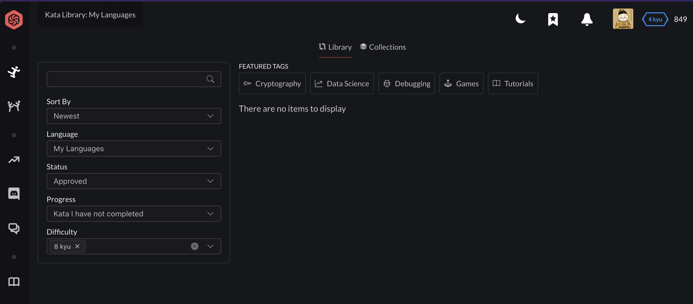

# 零：狂扫三百余题破童蒙，闲敲一二代码度新岁

## 00

从 [codewars](https://www.codewars.com/kata/search/my-languages?q=&r%5B%5D=-8&xids=completed&beta=false&order_by=total_completed%20desc) 最简单的题开始刷起。

## 01

继续前一天的 8kyu 的题，一共 340 道，这几天给刷完。

- `x << 1` 左移乘 2
- `x & 1` 判断奇偶性，可以直接替换 `x % 2`
- `x & (x - 1)` 去掉最低位的 1，可以判断是否是 2 的幂
- `x & -x` 得到最低位的 1

## 02

8kyu 的题还剩 285 道，相当于一天刷了 55 道，看今天能不能再刷 100 道。

## 03

昨天周五部门年会没刷多少，还剩 200 道。

今天周六随便刷刷吧，边玩游戏边刷，快乐刷题。

## 04

Progress: 170 / 340

Status: 睡爽了，也玩爽了，快乐刷题

## 05

年前的周一，啥事没有，就只有 70 道了，加油！

## 06

在公司的最后一天，终于刷完了幼儿园题目，明天回家路上正好规划一下下一步做啥。



## 07

主线：灵神的 [题单](https://leetcode.cn/discuss/post/3141566/ru-he-ke-xue-shua-ti-by-endlesscheng-q3yd/) + [基础算法精讲](https://www.bilibili.com/video/BV1bP411c7oJ/?vd_source=4da426ef9b0e129787ecf66363321458)

支线：[Exercism Python Track](https://exercism.org/tracks/python)，偶尔还可以刷刷 codewars 剩下的五千多道 kata

今日进展：[编程初学者的力扣适应手册](https://leetcode.cn/studyplan/primers-list/)

## 08

2.12，在老家第一天，完全不想刷题，继续力扣的入门题单。

### 1512. 好数对的数目

```py
class Solution:
    def numIdenticalPairs(self, nums: List[int]) -> int:
        ans = 0
        cnt = defaultdict(int)
        for x in nums:
            ans += cnt[x] # 先计算之前出现的次数
            cnt[x] += 1
        return ans
```

## 09

2.13，在家的第二天，一天只刷一道，太难的解法就不看了，懒得动脑子。

## 10

情人节耶，刷几道题吧。
