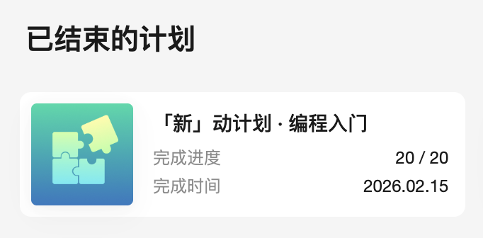

# Day11 - Day21

## 11

老朋友见面，回老家，继续刷 Exercism 的简单题。

## 12

除夕，忙里抽闲，小刷两道，力扣新手提单完成（全暴力解，完全不动脑）。



## 13

大年初一，补觉，写了两道 Exercism 的题。

## 14

初二，2.18，Exercism 进度 16/146 😄

## 15

初三，20 / 146，补觉。

## 16

初四，歇，一道题。

## 17

初五，游戏，一道题，心情好差。

## 18

初六，痛苦，一道题，等上班再开始奋斗好了。

## 19

2.23，[滑动窗口题单](https://wnykuang.github.io/lc-rating/studyplan/sliding_window/) 开始。

三步走：

- 入：下标为 i 的元素进入窗口，更新相关统计量。如果窗口左端点 i−k+1<0，则尚未形成第一个窗口，重复第一步
- 更新：更新答案。一般是更新最大值/最小值
- 出：下标为 i−k+1 的元素离开窗口，更新相关统计量，为下一个循环做准备

### 1456. 定长子串中元音的最大数目

```py
class Solution:
    def maxVowels(self, s: str, k: int) -> int:
        ans = vowel = 0
        for i, c in enumerate(s):
            if c in "aeiou":
                vowel += 1

            left = i - k + 1
            if left < 0:
                continue

            ans = max(ans, vowel)
            if ans == k:
                break

            if s[left] in "aeiou":
                vowel -= 1

        return ans
```

### 643. 子数组最大平均数 I

```py
class Solution:
    def findMaxAverage(self, nums: List[int], k: int) -> float:
        max_s = -inf
        s = 0
        for i, x in enumerate(nums):
            s += x
            if i < k - 1:
                continue
            max_s = max(max_s, s)
            s -= nums[i - k + 1]
        return max_s / k
```

## 20

上班，坐那就是爽，刷了几道定长的简单题。

## 21

把定长基础和其他的做完了，开始进阶，依旧带薪刷题。

发现加加减减的用 `zip` 模板更简单：

```py
class Solution:
    def findMaxAverage(self, nums: List[int], k: int) -> float:
        s = max_s = sum(nums[:k])
        for in_, out in zip(nums[k:], nums):
            s += in_ - out
            max_s = max(max_s, s)
        return max_s / k
```
